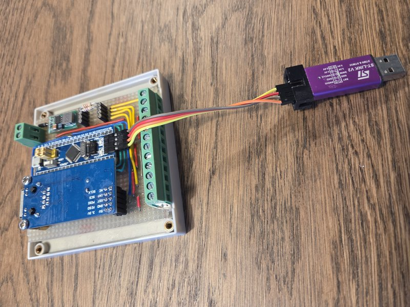
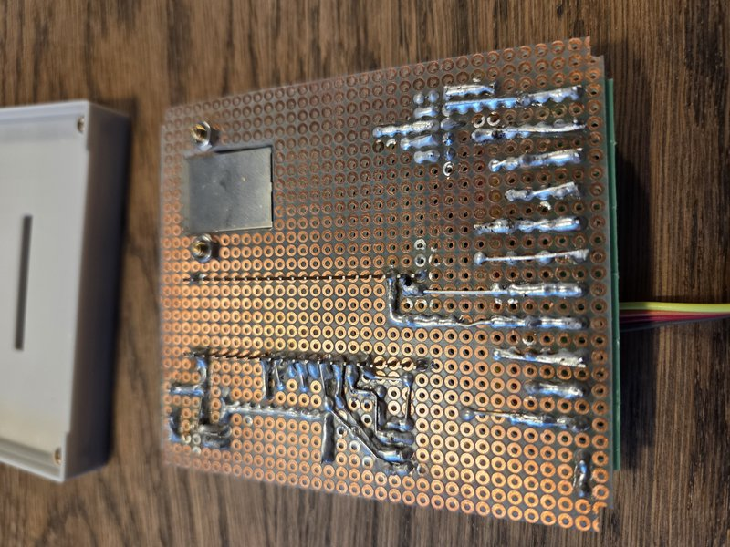
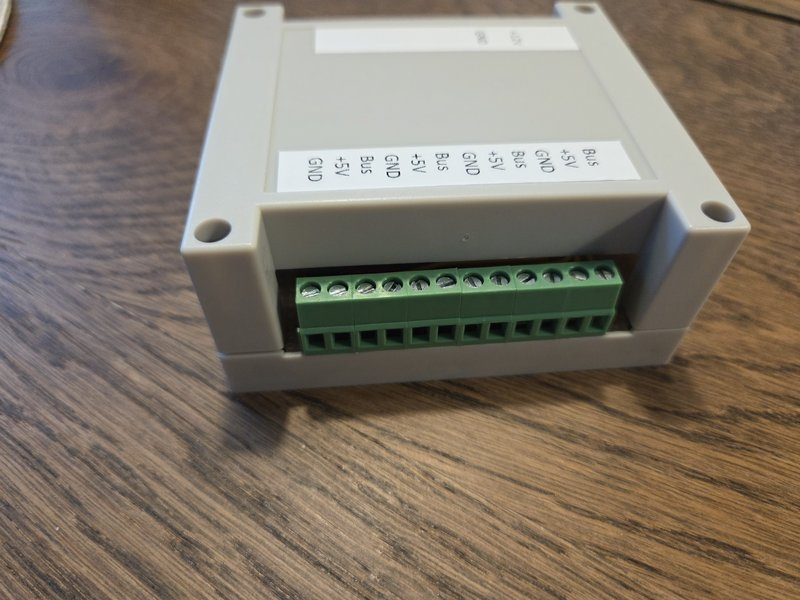
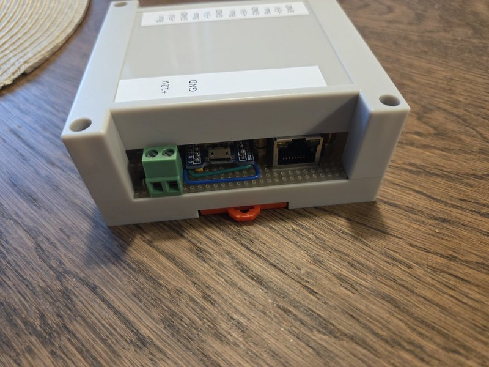
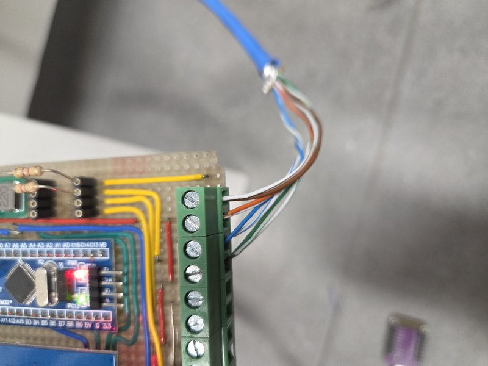
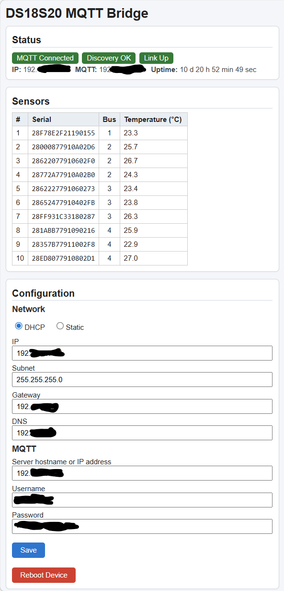
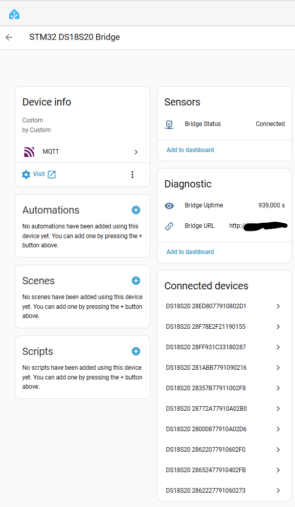
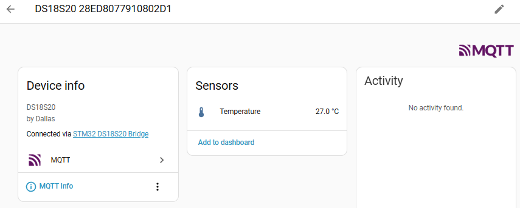

# STM32 DS18S20 MQTT Bridge

An Arduino-based firmware for the STM32F103 ("Blue Pill" 64KB flash / 20KB SRAM), compact and flash‑optimized, that discovers multiple DS18S20 temperature sensors on up to four 1‑Wire buses and publishes data to an MQTT broker with Home Assistant auto‑discovery. Built with the Arduino IDE and STM32 core, it includes a minimal embedded web UI for network + MQTT configuration, EEPROM persistence with CRC16 integrity, watchdog safety, reboot + factory reset options, and automatic link recovery.

### Why STM32?
The primary motivation for choosing the STM32F103 was its **5V‑tolerant GPIO pins**. Reliable 1‑Wire communication over very long, multi‑sensor cable runs requires 5V signaling levels. Unlike most ARM boards (and the ESP family) that are strictly 3.3V, the Blue Pill's 5V‑tolerant inputs allow direct connection to a 5V 1‑Wire bus without level shifters — simplifying wiring and improving signal integrity over long distances.

> Planning to add heavier features later (TLS/SSL, JSON parsing libraries, OTA, richer diagnostics)? Start with a 128KB flash STM32F103 (e.g. F103CB) or a higher‑end STM32 (e.g. F303/F4) for headroom. This 64KB build is intentionally near the size limit.

---
## Key Features
- Multi‑bus 1‑Wire (4 buses: PA0–PA3, all 5V tolerant) scanning with address CRC validation
- Supports up to 12 DS18S20 sensors (configurable limit to constrain flash/RAM & discovery load)
- Non‑blocking temperature conversion cycle (async request + later read)
- MQTT publishing (PubSubClient) with exponential backoff reconnect + link-up retry after cable replug
- Home Assistant Discovery (bridge status + per‑sensor temperature entities) with:
  - Manufacturer/Model metadata (Bridge: Custom/Custom, Sensors: Dallas/DS18S20)
  - Compact entity naming: each sensor entity name is just "Temperature" (no bus / serial appended)
  - Bus number exposed via retained JSON attributes topic (no separate serial / bus entities to save flash)
  - Shared availability via bridge LWT so entities remain and simply show unavailable if device offline
- Availability + uptime topics (bridge uptime in seconds; web UI shows human readable days/hours/mins/secs)
- Embedded HTTP configuration page (DHCP/static IP, DNS, MQTT credentials, reboot action)
- EEPROM‑stored configuration protected by CRC16 (corruption → fallback defaults)
- Reboot & factory reset mechanisms:
  - Short press PB12 (≥50 ms & <10 s): immediate reboot
  - Long press PB12 (≥10 s): factory reset + reboot
  - Boot hold PB12 LOW at power‑up: immediate factory reset before config load
- Independent hardware watchdog (IWDG) armed after safe startup window
- Millis() rollover safe timers + lightweight optional loop overrun monitor
- Flash‑conscious single‑file design (optimized strings / buffers, JSON handcrafted — no ArduinoJson)

---
## Hardware Overview
| Component | Notes |
|----------|-------|
| MCU Board | STM32F103C8/T8 "Blue Pill" (64KB flash, 20KB SRAM) |
| Ethernet | WIZnet W5500 module (e.g. WIZ5500 or generic W5500 board) |
| Sensors | DS18S20 (or compatible 1‑Wire temperature sensors) powered at 5V for long cable robustness |
| Pull‑Ups | 2.2–4.7kΩ from each 1‑Wire data line (PA0–PA3) to 5V (tune for bus length) |
| Reset / Reboot Button | Momentary switch to PB12 (active LOW, internal pull‑up enabled) |
| Power | 12V input → external 12V→5V step‑down → 5V feeds Blue Pill + W5500 boards (their onboard 3.3V LDOs supply logic); sensors also fed from 5V |

> Use good grounding and short stubs on each 1‑Wire bus. For long runs: twisted pair (data + GND), consistent 5V distribution, local decoupling (0.1µF near each sensor) and possibly a stronger pull‑up (closer to 2.2kΩ) if rise times degrade.

### Pin Assignments
| Function | STM32 Pin |
|----------|-----------|
| 1‑Wire Bus 1 (5V tolerant) | PA0 |
| 1‑Wire Bus 2 (5V tolerant) | PA1 |
| 1‑Wire Bus 3 (5V tolerant) | PA2 |
| 1‑Wire Bus 4 (5V tolerant) | PA3 |
| W5500 CS | PA4 |
| W5500 SCK | PA5 |
| W5500 MISO | PA6 |
| W5500 MOSI | PA7 |
| W5500 RESET | PB0 |
| Reboot / Factory Reset Button | PB12 (to GND when pressed) |
| LED (builtin) | Board LED (often PC13) |

### Basic Wiring (Summary)
- 12V source → buck regulator → stable 5V rail
- Blue Pill + W5500: power from 5V rail (their onboard LDOs generate local 3.3V)
- Each DS18S20: Data → one of PA0..PA3 (5V tolerant), VDD → 5V, GND → common ground
- 1.5–4.7kΩ pull‑up resistor from each data line to 5V (or shared per bus segment)
- W5500 SPI: PA4 (CS), PA5 (SCK), PA6 (MISO), PA7 (MOSI), PB0 → W5500 RST
- Button: PB12 to GND (internal pull‑up; keep lead short)

---
## Button Behavior Summary
| Action | Detection Window | Result |
|--------|------------------|--------|
| PB12 LOW at boot | During early init | Factory reset (defaults written) + reboot |
| PB12 LOW < 50 ms | Debounced noise | Ignored |
| PB12 LOW 50 ms – <10 s | Runtime | Clean reboot (config preserved) |
| PB12 LOW ≥10 s | Runtime | Factory reset + reboot |

---
## Factory Reset Details
After a factory reset the device boots with:
- DHCP enabled
- MQTT server/credentials cleared
- Default static fallback (only used if DHCP fails): 192.168.1.200 /24 GW 192.168.1.1 DNS 8.8.8.8

---
## Web Configuration UI
Served on port 80 at: `http://<device_ip>/`
Sections:
- Status (link, MQTT state, human-readable uptime: `X d HH h MM min SS sec`)
- Sensors table (live read when page loads)
- Configuration (Network + MQTT) with Save + Reboot Device button

Saving settings:
- Data validated and stored in EEPROM
- CRC16 recalculated and verified
- Device reboots automatically

---
## MQTT Topics (Examples)
Assuming MAC → `02:34:56:78:9A:BC` and sensor ROM `28FFD0123456789A` (bus 2):

| Purpose | Topic | Notes |
|---------|-------|-------|
| Bridge status (availability / LWT) | `homeassistant/bridge/023456789abc/status` | Retained `online` / `offline`; sensors reference this |
| Bridge uptime (seconds) | `homeassistant/bridge/023456789abc/uptime` | Retained, integer seconds (published each minute) |
| Sensor temperature state | `homeassistant/sensor/ds18s20_28ffd0123456789a/temperature/state` | Numeric string (°C, 1 decimal) |
| Sensor attributes (bus) | `homeassistant/sensor/ds18s20_28ffd0123456789a/temperature/attrs` | Retained JSON `{"bus":2}` |

> No per‑sensor availability topic: Home Assistant derives availability from the shared bridge LWT, so entities persist and simply show unavailable when the bridge is offline.

### Discovery Entity Naming
- Entity name: `Temperature`
- Device name (in HA device registry): `DS18S20 <ROM>` (e.g. `DS18S20 28FFD0123456789A`)
- Bus number included only in attributes JSON to reduce flash usage and avoid name churn if re‑ordered.

### Device Metadata
Discovery payload includes:
- Bridge: manufacturer=`Custom`, model=`Custom`
- Sensors: manufacturer=`Dallas`, model=`DS18S20`

---
## Dependencies
Install via Arduino IDE / Boards Manager / Library Manager (versions tested shown):

| Type | Name | Notes |
|------|------|-------|
| Board Package | STMicroelectronics STM32 core (e.g. 2.11.0) | Select Generic STM32F103C8, optimize for size |
| Library | Ethernet (WIZnet) | W5500 support (from STM32 core or Arduino Ethernet) |
| Library | PubSubClient by Nick O'Leary | MQTT client (buffer set to 1024 bytes in code) |
| Library | OneWire by Jim Studt / Paul Stoffregen | 1‑Wire bus |
| Library | DallasTemperature by Miles Burton | High‑level DS18x20 access |
| Library | EEPROM (core) | Emulated / flash backed |

Optional compile flags: disable uptime (`#define ENABLE_UPTIME 0`) or overrun monitor to reclaim flash.

---
## Build Guidelines
1. Install STM32 board support (Boards Manager: `STM32 MCU based boards` by STMicroelectronics).
2. Select optimization: `Smallest (default)` (size focused).
3. CPU 72 MHz, upload via ST‑Link or serial bootloader.
4. Serial monitor 115200 baud for diagnostics.
5. If modifying discovery JSON, ensure MQTT buffer (`mqtt.setBufferSize(1024)`) remains large enough.

---
## Performance / Reliability Notes
- Non‑blocking sensor cycle: avoids >1s stalls; conversions overlap.
- Rollover safety: timers tolerate `millis()` wrap.
- EEPROM CRC: prevents silent corruption; mismatch loads defaults.
- Watchdog: armed only after initialization to avoid false resets.
- Link change retry: network stack reconfigured when a cable is re‑plugged (link transition OFF→ON).
- Shared availability: simplifies HA config and reduces retained topic count.
- Flash usage near limit by design; strings aggressively shortened.

---
## Extending
Flash budget is tight on 64KB parts. For larger additions (TLS/SSL, HTTPS, richer JSON handling, OTA), migrate to a 128KB (STM32F103CB) or higher resource MCU.

To free space on current target you can remove:
- Uptime MQTT sensor (keep only web uptime display)
- Attributes topic (bus info)
- Reduce max sensors or buses
- Shorten or drop diagnostic discovery entities (URL, uptime)
- Disable debug prints / overrun monitor

---
## Security Considerations
- No TLS (resource constraints); deploy inside trusted LAN/VLAN.
- Web UI has no authentication; restrict access via network controls.
- MQTT credentials stored plaintext in EEPROM.

---
## Photos of the Built Unit

---
## Device Web UI

---
## Home Assistant MQTT Integration

---
## Troubleshooting
| Symptom | Hint |
|---------|------|
| DHCP fails | Falls back to static 192.168.1.200 – verify cabling / switch |
| Sensors = 0 | Check pull‑ups, wiring, and 5V stability; allow initial rescan (5s) |
| MQTT not connecting | Verify broker host/IP & credentials; DNS requires valid DNS server |
| Entities vanish in HA | Ensure discovery topics retained; keep bridge LWT consistent |
| Random resets | Check power; look for watchdog messages before reset |
| CRC mismatch on boot | EEPROM corrupted; defaults loaded (reconfigure) |
| Bus attribute wrong | Verify wiring order matches PA0..PA3 numbering |

---
## License (MIT)
Copyright (c) 2025 Mikko Martsola

Permission is hereby granted, free of charge, to any person obtaining a copy
of this software and associated documentation files (the "Software"), to deal
in the Software without restriction, including without limitation the rights
to use, copy, modify, merge, publish, distribute, sublicense, and/or sell
copies of the Software, and to permit persons to whom the Software is
furnished to do so, subject to the following conditions:

The above copyright notice and this permission notice shall be included in all
copies or substantial portions of the Software.

THE SOFTWARE IS PROVIDED "AS IS", WITHOUT WARRANTY OF ANY KIND, EXPRESS OR
IMPLIED, INCLUDING BUT NOT LIMITED TO THE WARRANTIES OF MERCHANTABILITY,
FITNESS FOR A PARTICULAR PURPOSE AND NONINFRINGEMENT. IN NO EVENT SHALL THE
AUTHORS OR COPYRIGHT HOLDERS BE LIABLE FOR ANY CLAIM, DAMAGES OR OTHER
LIABILITY, WHETHER IN AN ACTION OF CONTRACT, TORT OR OTHERWISE, ARISING FROM,
OUT OF OR IN CONNECTION WITH THE SOFTWARE OR THE USE OR OTHER DEALINGS IN THE
SOFTWARE.

---
## Disclaimer
Provided as‑is with no warranty. Use at your own risk in production environments.

---
Happy monitoring!
